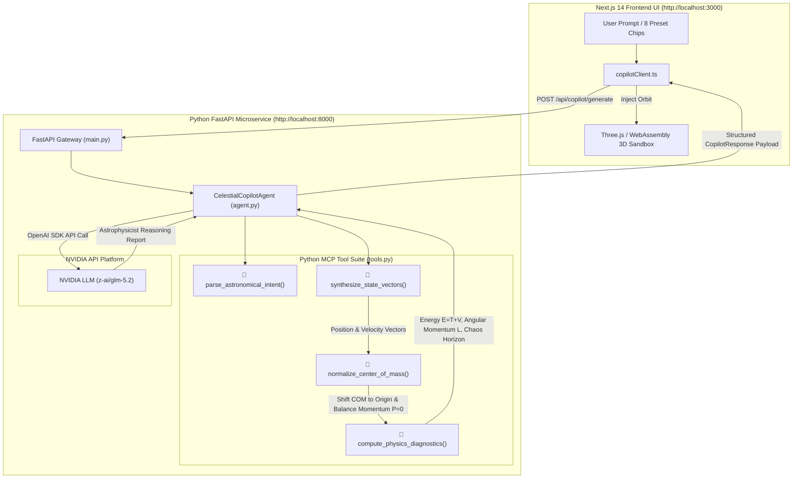
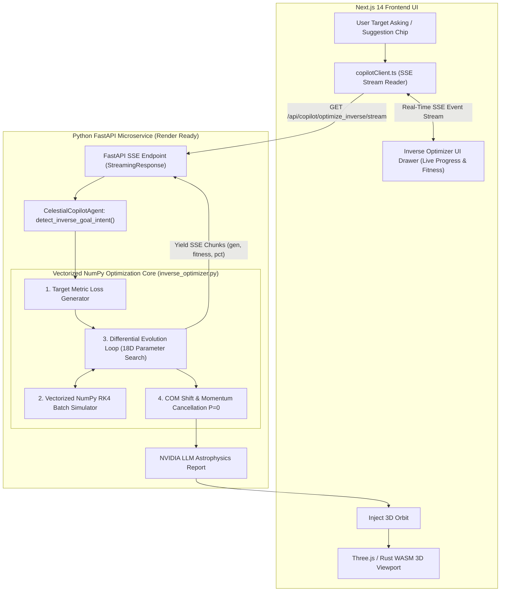
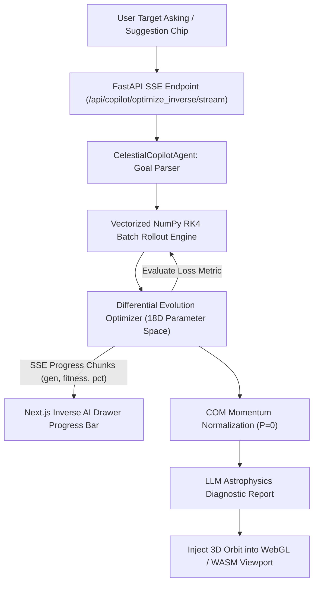
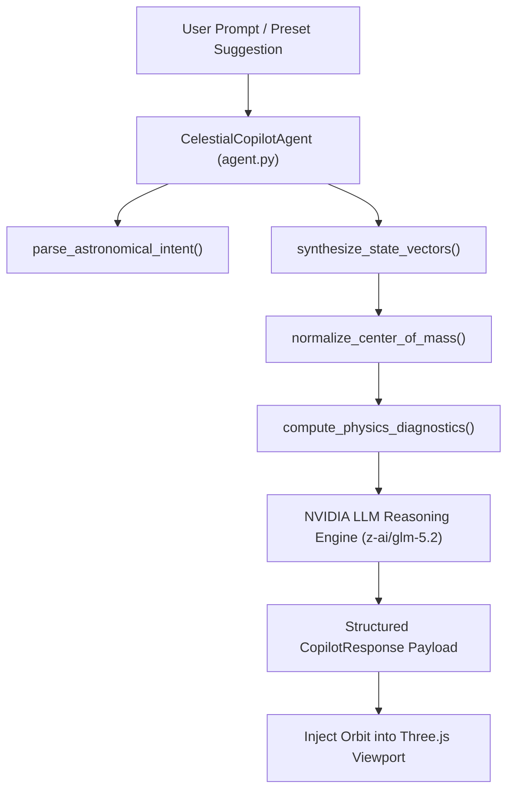
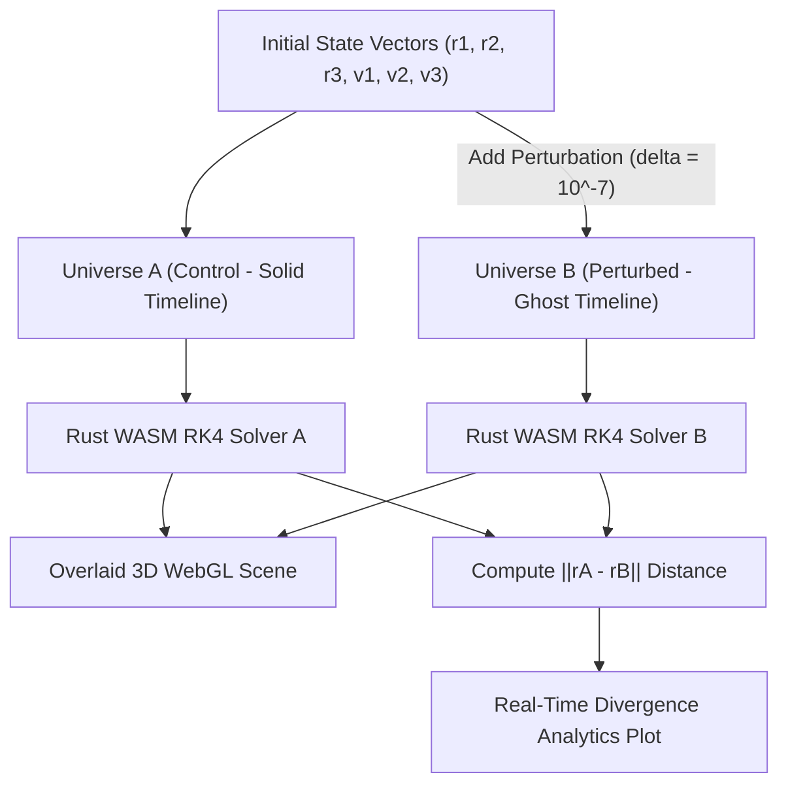
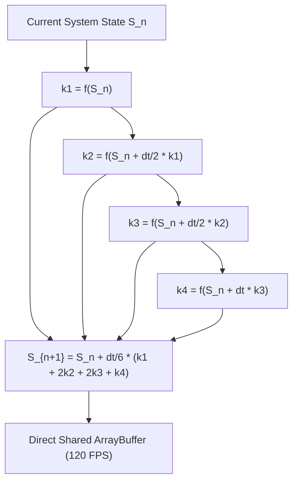
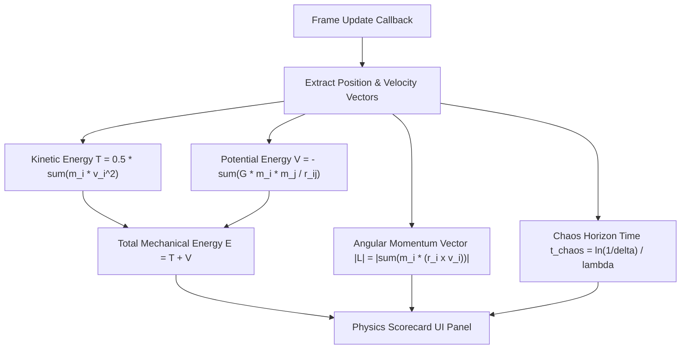
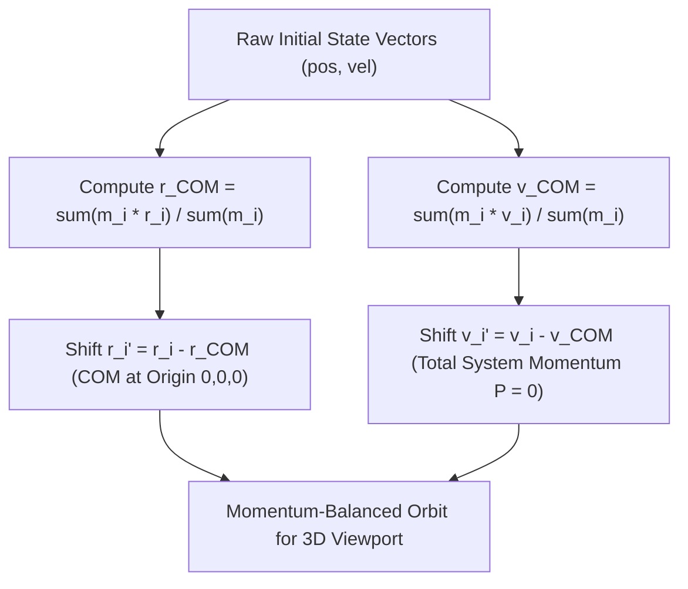

# AstraChaos 3D 🦋🪐

[](https://Pranjalya.github.io/AstraChaos-3D)
[](LICENSE)
[](https://fastapi.tiangolo.com/)
[](https://integrate.api.nvidia.com/)
[](https://www.rust-lang.org/)
[](https://nextjs.org/)

**AstraChaos 3D** is a high-performance, dark-themed 3D celestial mechanics sandbox & Agentic Physics Copilot engineered to physically demonstrate the **Butterfly Effect** (extreme sensitivity to initial conditions) using the deterministic chaos of the **Three-Body Problem**.

Architected & Developed by **[Pranjalya Tiwari](https://github.com/Pranjalya)**.

👉 **[Launch Live Interactive Sandbox](https://Pranjalya.github.io/AstraChaos-3D)**

---

## 🌟 Core Concept

The application simulates **two parallel gravitational universes** overlaid on top of each other in a real-time 3D WebGL scene:

1. **Universe A (Control - Solid Timeline):** Follows the exact initial positions and velocities set by the user or synthesized by the **Agentic Physics Copilot**.
2. **Universe B (Perturbed - Ghost Timeline):** Displaces Planet 1's position by a microscopic fraction (e.g., $\delta = 10^{-7} = 0.0000001$) relative to Universe A.

As time ticks forward, both universes initially overlap perfectly before reaching a **chaotic inflection point**, where they violently split apart into radically different 3D spatial trajectories!

---

## 🛠️ Architecture & Tech Stack

- **Agentic AI Backend:** Python 3.10+, FastAPI, REST API, Uvicorn, Docker, Pytest
- **LLM Tool Orchestrator:** NVIDIA API (`z-ai/glm-5.2` / `nvidia/nemotron-3-nano-30b-a3b`)
- **Frontend Framework:** Next.js 14 (App Router) & TypeScript
- **3D Graphics Engine:** Three.js using React Three Fiber (`@react-three/fiber`) & `@react-three/drei`
- **High-Performance Physics Core:** Rust compiled to WebAssembly via `wasm-pack`
- **Numerical Integrator:** 4th-Order Runge-Kutta (RK4) Solver with softening parameter $\epsilon^2$
- **Styling & UI:** Tailwind CSS (Glassmorphic Dark Theme) & Lucide Icons
- **Real-Time Analytics:** Recharts (Euclidean Distance Divergence Chart)
- **Deployment:** Dockerized Python Backend published to GHCR & Static Client on GitHub Pages via CI/CD Workflows

---

## 🏗️ Agentic Backend Architecture & MCP Tool Suite

<details>
<summary>🔍 <b>View Agentic Copilot Microservice Architecture & MCP Tool Flow Diagram</b></summary>


</details>

---

## 🎯 Target-Driven Generative Inverse Physics Agent Architecture

The **Inverse Physics Agent** allows users to reverse-engineer chaotic initial condition state vectors $(\mathbf{r}_1, \mathbf{r}_2, \mathbf{r}_3, \mathbf{v}_1, \mathbf{v}_2, \mathbf{v}_3)$ by posing natural language target askings (e.g. *"slingshot boost"*, *"eject Body 3"*, *"binary capture"*, *"trojan equilibrium"*).

The Python backend executes a **vectorized Differential Evolution algorithm (CMA-ES style)** over 18D state vector space and streams real-time Server-Sent Events (SSE) back to the Next.js UI progress bar.

<details>
<summary>🔍 <b>View Inverse Optimization Engine & SSE Stream Architecture Diagram</b></summary>


</details>

---

## 🤖 Agentic AI Orchestration & MCP Tool Framework

**AstraChaos 3D** incorporates an **Agentic Physics Copilot** engineered around Model Context Protocol (MCP) design principles. When a user submits a natural language prompt, `CelestialCopilotAgent` orchestrates intent parsing, 3D state synthesis, physical momentum conservation, and LLM astrophysics reasoning across a specialized Python tool suite:

### ⚙️ Python MCP Tool Suite (`backend/app/tools.py`)

1. **`parse_astronomical_intent(prompt: str)`**
   * **Role:** Evaluates user prompt for celestial mechanics patterns (*"binary star"*, *"figure-eight"*, *"pythagorean collision"*, *"slingshot"*, *"trojan"*, *"tidal ejection"*).
   * **Output:** Selects appropriate mathematical orbital topology and mass distribution.

2. **`synthesize_state_vectors(topology, perturbation)`**
   * **Role:** Formulates 3D initial position vectors $\mathbf{r}_1, \mathbf{r}_2, \mathbf{r}_3 \in \mathbb{R}^3$, velocity vectors $\mathbf{v}_1, \mathbf{v}_2, \mathbf{v}_3 \in \mathbb{R}^3$, and mass ratios $m_1, m_2, m_3$.
   * **Output:** Initial condition state vector matrices and per-body signature color schemes.

3. **`normalize_center_of_mass(masses, pos, vel)`**
   * **Role:** Applies linear transformations to shift Center of Mass (COM) to origin $(0,0,0)$ and cancel total system momentum:
     $$\mathbf{r}_{\text{COM}} = \frac{\sum m_i \mathbf{r}_i}{\sum m_i} = \mathbf{0}, \quad \mathbf{P} = \sum m_i \mathbf{v}_i = \mathbf{0}$$
   * **Output:** Momentum-balanced state vectors that prevent linear drift in the WebGL 3D viewport.

4. **`compute_physics_diagnostics(masses, pos, vel, perturbation)`**
   * **Role:** Evaluates Hamiltonian mechanical energy $E = T + V$, total angular momentum $\|\mathbf{L}\| = \|\sum m_i (\mathbf{r}_i \times \mathbf{v}_i)\|$, Lyapunov divergence exponent $\lambda$, and chaos horizon time:
     $$t_{\text{chaos}} \approx \frac{\ln(1/\delta)}{\lambda}$$
   * **Output:** Real-time physics scorecard and quantitative stability classification.

5. **`nvidia_nemotron_llm_reasoning(prompt, system_type, mass_ratio)`**
   * **Role:** Invoices NVIDIA LLM platform (`z-ai/glm-5.2`) for domain-specific astrophysics reasoning, detailing gravitational potential wells, resonance boundaries, and chaotic scattering zones.
   * **Output:** Synthesized astrophysicist diagnostic report embedded into response payload.

---

### 🔄 Resilient Dual-Engine Execution Strategy

To guarantee **100% uptime and zero-downtime client interaction**:
* **Online FastAPI Mode:** Connects to Python microservice at `http://localhost:8000` for full LLM reasoning and server-side tool execution.
* **Offline Client Fallback (GitHub Pages):** If the backend server is offline or hosted as a static web app, `copilotClient.ts` gracefully activates an in-browser deterministic tool suite, ensuring zero UI crashes or broken user flows.

---

## 🐳 Docker Container & GitHub Container Registry (GHCR)

The Python FastAPI backend is containerized and automatically compiled, tested, and published to **GitHub Container Registry (GHCR)** using GitHub Actions (`.github/workflows/docker-ghcr.yml`).

### Pull & Run Container from GHCR

```bash
# 1. Pull latest container image from GHCR
docker pull ghcr.io/pranjalya/astrachaos-3d-backend:latest

# 2. Launch container exposing port 8000
docker run -d \
  -p 8000:8000 \
  -e NVIDIA_API_KEY="your_nvidia_api_key_here" \
  --name astrachaos-backend \
  ghcr.io/pranjalya/astrachaos-3d-backend:latest
```

### Local Docker Build

```bash
# Build and run locally
cd backend
docker build -t astrachaos-3d-backend .
docker run -p 8000:8000 -e NVIDIA_API_KEY="your_nvidia_api_key_here" astrachaos-3d-backend
```


---

## 🚀 Key Features & Architecture Breakdown

### 🎯 1. Target-Driven Generative Inverse Physics Agent ("Inverse Trajectory Optimizer")
Reverse-engineers 18D initial state vectors $(\mathbf{r}_1, \mathbf{r}_2, \mathbf{r}_3, \mathbf{v}_1, \mathbf{v}_2, \mathbf{v}_3)$ from natural language askings or preset chips using **Differential Evolution & Server-Sent Events (SSE)**.
* **Natural Language Target Asking:** Type custom target requests like *"Find an initial condition where Body 3 slingshots around Body 1 with maximum speed boost"* or *"Eject Body 3 into deep space"*.
* **5 Signature Target Chips:** 🚀 Slingshot Boost, ☄️ Chaotic Ejection, 🌌 Binary Capture & Exchange, 🛡️ Trojan Equilibrium, and 💥 Triple Close Flyby.
* **Real-Time Progress Streaming:** Streams per-generation optimization progress (`progress_pct`, `generation`, `best_fitness`) over HTTP/1.1 via FastAPI `StreamingResponse`.
* **One-Click 3D Orbit Injection:** Injects momentum-balanced initial state vectors directly into the live WebGL 3D canvas.

<details>
<summary>🔍 <b>View Inverse Optimization Architecture & SSE Stream Diagram</b></summary>


</details>

---

### 🤖 2. Agentic AI Celestial Copilot & Python MCP Tool Suite
Synthesizes celestial system topologies and mass distributions from plain English prompts using **Python FastAPI & NVIDIA Nemotron LLM**.
* **MCP-Style Tool Call Execution Stream:** Displays real-time tool logs (`parse_astronomical_intent`, `synthesize_state_vectors`, `normalize_center_of_mass`, `compute_physics_diagnostics`).
* **Resilient Dual-Engine Strategy:** Connects to FastAPI microservice when online, and automatically activates an in-browser deterministic tool suite for static GitHub Pages deployments.

<details>
<summary>🔍 <b>View Agentic MCP Tool Suite Orchestration Diagram</b></summary>


</details>

---

### 🦋 3. Dual-Universe Butterfly Effect & Quantum Perturbation Engine
Physically demonstrates extreme sensitivity to initial conditions by running **two parallel gravitational universes** simultaneously in the 3D scene.
* **Universe A (Control):** Follows exact initial state vectors $(\mathbf{r}_0, \mathbf{v}_0)$ rendered with solid bodies and continuous trails.
* **Universe B (Perturbed):** Displaces Body 1's position by a microscopic fraction ($\delta = 10^{-7}$) rendered with wireframe ghost halos and trails.
* **Quantum Perturbation Slider:** Scale initial "butterfly nudge" from $10^{-3}$ down to $10^{-9}$ to observe shift in chaos horizon time.

<details>
<summary>🔍 <b>View Parallel Universe Divergence Diagram</b></summary>


</details>

---

### ⚡ 4. High-Performance Rust / WebAssembly 4th-Order Runge-Kutta (RK4) Core
Delivers sub-millisecond numerical integration using a compiled **Rust WASM physics engine** (`wasm-pack`).
* **Numerical Precision:** 4th-Order Runge-Kutta (RK4) integrator with gravitational softening parameter $\epsilon^2 = 0.005$ to prevent singular accelerations during close encounters.
* **120 FPS Rendering:** Zero-allocation WASM shared memory arrays piped directly into Three.js instanced meshes and trail buffers.

<details>
<summary>🔍 <b>View Rust WASM RK4 Integration Stage Diagram</b></summary>


</details>

---

### 📈 5. Real-Time Divergence Analytics & Physics Scorecard
Evaluates real-time mechanical invariants and chaos progression.
* **Euclidean Divergence Analytics:** Real-time Recharts plot tracking $\|\mathbf{r}_A - \mathbf{r}_B\|$ over time on linear and $\log_{10}$ logarithmic scales.
* **Physics Diagnostics Scorecard:** Real-time calculation of Hamiltonian total energy $E = T + V$, kinetic energy $T$, potential energy $V$, total angular momentum magnitude $\|\mathbf{L}\|$, and Lyapunov chaos horizon time $t_{\text{chaos}} \approx \frac{\ln(1/\delta)}{\lambda}$.

<details>
<summary>🔍 <b>View Real-Time Telemetry & Scorecard Flow Diagram</b></summary>


</details>

---

### 🏛️ 6. Orbital Presets Vault & Interactive Controls
* **Presets Vault:** Instantly spin up Chenciner Figure-Eight, Pythagorean 3-Body (Burrau), Lagrange Horseshoe, Chaotic Triple Collision, and Euler Collinear orbits.
* **Momentum Normalization:** Automatic Center of Mass shift to origin $(0,0,0)$ and system momentum cancellation ($\mathbf{P} = \sum m_i \mathbf{v}_i = \mathbf{0}$).
* **Custom Control Suite:** Hex color pickers per body, live body mass sliders ($m_1, m_2, m_3$), size scaling ($R_{\text{scale}}$), target-lock camera tracking (Body 1, 2, 3, or COM), and collapsible drawer sections.

<details>
<summary>🔍 <b>View Center of Mass & Momentum Normalization Diagram</b></summary>


</details>

---

## 📚 Academic Citations & References

If you use **AstraChaos 3D** for academic research, education, or visual physics demonstrations, please cite the foundational literature on deterministic celestial chaos and periodic 3-body choreography:

### Foundational Papers

1. **Poincaré, H. (1890).** *Sur le problème des trois corps et les équations de la dynamique.* Acta Mathematica, 13(1), 1–270. [DOI: 10.1007/BF02392506](https://doi.org/10.1007/BF02392506)
   - *Landmark paper demonstrating non-integrability and sensitive dependence on initial conditions in 3-body gravitational systems.*

2. **Lorenz, E. N. (1963).** *Deterministic Nonperiodic Flow.* Journal of the Atmospheric Sciences, 20(2), 130–141. [DOI: 10.1175/1520-0469(1963)020<0130:DNF>2.0.CO;2](https://doi.org/10.1175/1520-0469(1963)020%3C0130:DNF%3E2.0.CO;2)
   - *Formulated the mathematical foundation of the "Butterfly Effect" (exponential Lyapunov divergence).*

3. **Chenciner, A., & Montgomery, R. (2000).** *A remarkable periodic solution of the three-body problem in the case of equal masses.* Annals of Mathematics, 152(3), 881–901. [DOI: 10.2307/2661357](https://doi.org/10.2307/2661357)
   - *Mathematical proof and discovery of the 3D Figure-Eight periodic orbit implemented in our Presets Vault.*

4. **Szebehely, V., & Peters, C. F. (1967).** *Complete Solution of the Pythagorean Problem of Three Bodies.* Astronomical Journal, 72, 876–883. [DOI: 10.1086/110355](https://doi.org/10.1086/110355)
   - *Numerical integration and gravitational scattering analysis of Burrau's 3:4:5 Pythagorean 3-body system.*

---

### BibTeX

```bibtex
@article{poincare1890probleme,
  author    = {Poincar{\'e}, Henri},
  title     = {Sur le probl{\`e}me des trois corps et les {\'e}quations de la dynamique},
  journal   = {Acta Mathematica},
  volume    = {13},
  number    = {1},
  pages     = {1--270},
  year      = {1890},
  publisher = {Springer}
}

@article{lorenz1963deterministic,
  author    = {Lorenz, Edward N.},
  title     = {Deterministic Nonperiodic Flow},
  journal   = {Journal of the Atmospheric Sciences},
  volume    = {20},
  number    = {2},
  pages     = {130--141},
  year      = {1963}
}

@article{chenciner2000remarkable,
  author    = {Chenciner, Alain and Montgomery, Richard},
  title     = {A remarkable periodic solution of the three-body problem in the case of equal masses},
  journal   = {Annals of Mathematics},
  volume    = {152},
  number    = {3},
  pages     = {881--901},
  year      = {2000}
}

@misc{tiwari2026astrachaos,
  author    = {Tiwari, Pranjalya},
  title     = {AstraChaos 3D: High-Performance Interactive 3D Three-Body Problem \& Butterfly Effect Sandbox},
  year      = {2026},
  publisher = {GitHub},
  journal   = {GitHub Repository},
  howpublished = {\url{https://github.com/Pranjalya/AstraChaos-3D}}
}
```

---

## ⚙️ Local Installation & Setup

### Prerequisites
Ensure you have **Node.js (v18+)**, **Rust**, and **wasm-pack** installed on your system.

```bash
# 1. Clone the Repository
git clone https://github.com/Pranjalya/AstraChaos-3D.git
cd AstraChaos-3D

# 2. Compile the Physics Engine (Rust to WASM)
cd wasm-physics
wasm-pack build --target web --out-dir ../public/wasm
cd ..

# 3. Install Dependencies
npm install

# 4. Launch Local Development Server
npm run dev
```

Open `http://localhost:3000` in your browser to launch the interface.

---

## 👤 Author & Credits

- **Developer:** [Pranjalya Tiwari](https://github.com/Pranjalya)
- **GitHub Repository:** [https://github.com/Pranjalya/AstraChaos-3D](https://github.com/Pranjalya/AstraChaos-3D)
- **Live Site:** [https://Pranjalya.github.io/AstraChaos-3D](https://Pranjalya.github.io/AstraChaos-3D)

---

## 📄 License

This project is licensed under the [MIT License](LICENSE).