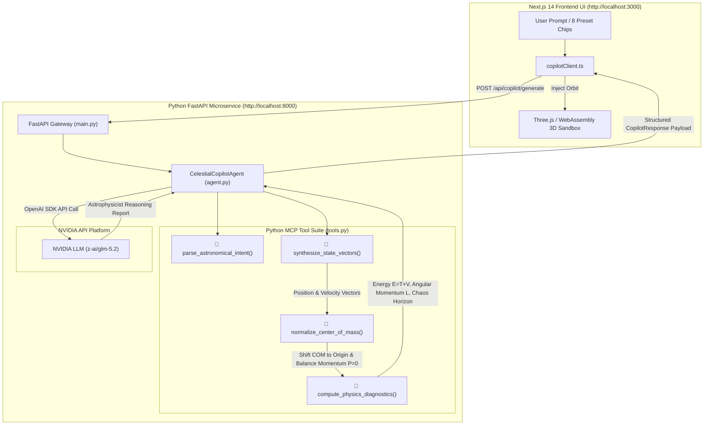

# AstraChaos 3D 🦋🪐

[](https://Pranjalya.github.io/AstraChaos-3D)
[](LICENSE)
[](https://fastapi.tiangolo.com/)
[](https://integrate.api.nvidia.com/)
[](https://www.rust-lang.org/)
[](https://nextjs.org/)

**AstraChaos 3D** is a high-performance, dark-themed 3D celestial mechanics sandbox & Agentic Physics Copilot engineered to physically demonstrate the **Butterfly Effect** (extreme sensitivity to initial conditions) using the deterministic chaos of the **Three-Body Problem**.

Architected & Developed by **[Pranjalya Tiwari](https://github.com/Pranjalya)**.

👉 **[Launch Live Interactive Sandbox](https://Pranjalya.github.io/AstraChaos-3D)**

---

## 🌟 Core Concept

The application simulates **two parallel gravitational universes** overlaid on top of each other in a real-time 3D WebGL scene:

1. **Universe A (Control - Solid Timeline):** Follows the exact initial positions and velocities set by the user or synthesized by the **Agentic Physics Copilot**.
2. **Universe B (Perturbed - Ghost Timeline):** Displaces Planet 1's position by a microscopic fraction (e.g., $\delta = 10^{-7} = 0.0000001$) relative to Universe A.

As time ticks forward, both universes initially overlap perfectly before reaching a **chaotic inflection point**, where they violently split apart into radically different 3D spatial trajectories!

---

## 🛠️ Architecture & Tech Stack

- **Agentic AI Backend:** Python 3.10+, FastAPI, REST API, Uvicorn, Docker, Pytest
- **LLM Tool Orchestrator:** NVIDIA API (`z-ai/glm-5.2` / `nvidia/nemotron-3-nano-30b-a3b`)
- **Frontend Framework:** Next.js 14 (App Router) & TypeScript
- **3D Graphics Engine:** Three.js using React Three Fiber (`@react-three/fiber`) & `@react-three/drei`
- **High-Performance Physics Core:** Rust compiled to WebAssembly via `wasm-pack`
- **Numerical Integrator:** 4th-Order Runge-Kutta (RK4) Solver with softening parameter $\epsilon^2$
- **Styling & UI:** Tailwind CSS (Glassmorphic Dark Theme) & Lucide Icons
- **Real-Time Analytics:** Recharts (Euclidean Distance Divergence Chart)
- **Deployment:** Dockerized Python Backend published to GHCR & Static Client on GitHub Pages via CI/CD Workflows

---

## 🏗️ Agentic Backend Architecture & MCP Tool Suite



---

## 🐳 Docker Container & GitHub Container Registry (GHCR)

The Python FastAPI backend is containerized and automatically compiled, tested, and published to **GitHub Container Registry (GHCR)** using GitHub Actions (`.github/workflows/docker-ghcr.yml`).

### Pull & Run Container from GHCR

```bash
# 1. Pull latest container image from GHCR
docker pull ghcr.io/pranjalya/astrachaos-3d-backend:latest

# 2. Launch container exposing port 8000
docker run -d \
  -p 8000:8000 \
  -e NVIDIA_API_KEY="your_nvidia_api_key_here" \
  --name astrachaos-backend \
  ghcr.io/pranjalya/astrachaos-3d-backend:latest
```

### Local Docker Build

```bash
# Build and run locally
cd backend
docker build -t astrachaos-3d-backend .
docker run -p 8000:8000 -e NVIDIA_API_KEY="your_nvidia_api_key_here" astrachaos-3d-backend
```


---

## 🚀 Key Features

- 🤖 **Agentic Celestial Copilot & Natural Language Generator:** Synthesizes initial condition state vectors $(x,y,z,vx,vy,vz)$ and mass ratios from plain English prompts using **Python FastAPI & NVIDIA Nemotron LLM**.
- 🔧 **MCP-Style Tool Call Execution Stream:** Displays real-time agentic tool execution logs (`parse_astronomical_intent`, `synthesize_state_vectors`, `normalize_center_of_mass`, `compute_physics_diagnostics`).
- ⚡ **Physics Diagnostics Scorecard:** Evaluates Hamiltonian total energy $E = T + V$, angular momentum magnitude $\|\mathbf{L}\|$, chaos horizon time ($t_{\text{chaos}}$), and stability classification in real time.
- 🚀 **One-Click Sandbox Injection:** Injects generated state vectors directly into the live WebAssembly / Three.js 3D canvas with dynamic camera lock and custom color schemes.
- 🦋 **Dual-Timeline Overlays:** Watch Universe A (Solid Bodies & Trails) and Universe B (Wireframe Ghost Halos & Trails) move symmetrically before diverging.
- 🎨 **Signature Per-Body Color Coding:** Each body features a unique signature color scheme across both universes, customizable via hex pickers & preset palettes.
- ⚖️ **Mass & Size Customization:** Live body mass sliders ($m_1, m_2, m_3$) that alter gravitational warping ($F = G \frac{m_1 m_2}{r^2}$) in real-time, plus size scaling ($R_{scale}$).
- 🎛️ **Quantum Perturbation Slider:** Scale your initial "butterfly nudge" from $10^{-3}$ down to $10^{-9}$.
- 🎥 **Target Lock Camera Mode:** Anchor camera focus onto Body 1, 2, 3, or the system's Center of Mass with smooth frame-by-frame lerping.
- 🏛️ **Orbital Presets Vault:** Instantly spin up Chenciner Figure-Eight, Pythagorean 3-Body (Burrau), Lagrange Horseshoe, Chaotic Triple Collision, and Euler Collinear orbits.
- 📈 **Real-Time Divergence Analytics:** Live Recharts chart tracking Euclidean distance $\|\mathbf{r}_A - \mathbf{r}_B\|$ over time on linear and $\log_{10}$ scales.

- 🚀 **Interactive Onboarding Tour & Physics Guide:** Built-in step-by-step interactive UI tour and plain-language physics guide.
- 📱 **Fully Mobile Responsive:** Responsive layout optimized for smartphones, tablets, and desktop displays.

---

## 📚 Academic Citations & References

If you use **AstraChaos 3D** for academic research, education, or visual physics demonstrations, please cite the foundational literature on deterministic celestial chaos and periodic 3-body choreography:

### Foundational Papers

1. **Poincaré, H. (1890).** *Sur le problème des trois corps et les équations de la dynamique.* Acta Mathematica, 13(1), 1–270. [DOI: 10.1007/BF02392506](https://doi.org/10.1007/BF02392506)
   - *Landmark paper demonstrating non-integrability and sensitive dependence on initial conditions in 3-body gravitational systems.*

2. **Lorenz, E. N. (1963).** *Deterministic Nonperiodic Flow.* Journal of the Atmospheric Sciences, 20(2), 130–141. [DOI: 10.1175/1520-0469(1963)020<0130:DNF>2.0.CO;2](https://doi.org/10.1175/1520-0469(1963)020%3C0130:DNF%3E2.0.CO;2)
   - *Formulated the mathematical foundation of the "Butterfly Effect" (exponential Lyapunov divergence).*

3. **Chenciner, A., & Montgomery, R. (2000).** *A remarkable periodic solution of the three-body problem in the case of equal masses.* Annals of Mathematics, 152(3), 881–901. [DOI: 10.2307/2661357](https://doi.org/10.2307/2661357)
   - *Mathematical proof and discovery of the 3D Figure-Eight periodic orbit implemented in our Presets Vault.*

4. **Szebehely, V., & Peters, C. F. (1967).** *Complete Solution of the Pythagorean Problem of Three Bodies.* Astronomical Journal, 72, 876–883. [DOI: 10.1086/110355](https://doi.org/10.1086/110355)
   - *Numerical integration and gravitational scattering analysis of Burrau's 3:4:5 Pythagorean 3-body system.*

---

### BibTeX

```bibtex
@article{poincare1890probleme,
  author    = {Poincar{\'e}, Henri},
  title     = {Sur le probl{\`e}me des trois corps et les {\'e}quations de la dynamique},
  journal   = {Acta Mathematica},
  volume    = {13},
  number    = {1},
  pages     = {1--270},
  year      = {1890},
  publisher = {Springer}
}

@article{lorenz1963deterministic,
  author    = {Lorenz, Edward N.},
  title     = {Deterministic Nonperiodic Flow},
  journal   = {Journal of the Atmospheric Sciences},
  volume    = {20},
  number    = {2},
  pages     = {130--141},
  year      = {1963}
}

@article{chenciner2000remarkable,
  author    = {Chenciner, Alain and Montgomery, Richard},
  title     = {A remarkable periodic solution of the three-body problem in the case of equal masses},
  journal   = {Annals of Mathematics},
  volume    = {152},
  number    = {3},
  pages     = {881--901},
  year      = {2000}
}

@misc{tiwari2026astrachaos,
  author    = {Tiwari, Pranjalya},
  title     = {AstraChaos 3D: High-Performance Interactive 3D Three-Body Problem \& Butterfly Effect Sandbox},
  year      = {2026},
  publisher = {GitHub},
  journal   = {GitHub Repository},
  howpublished = {\url{https://github.com/Pranjalya/AstraChaos-3D}}
}
```

---

## ⚙️ Local Installation & Setup

### Prerequisites
Ensure you have **Node.js (v18+)**, **Rust**, and **wasm-pack** installed on your system.

```bash
# 1. Clone the Repository
git clone https://github.com/Pranjalya/AstraChaos-3D.git
cd AstraChaos-3D

# 2. Compile the Physics Engine (Rust to WASM)
cd wasm-physics
wasm-pack build --target web --out-dir ../public/wasm
cd ..

# 3. Install Dependencies
npm install

# 4. Launch Local Development Server
npm run dev
```

Open `http://localhost:3000` in your browser to launch the interface.

---

## 👤 Author & Credits

- **Developer:** [Pranjalya Tiwari](https://github.com/Pranjalya)
- **GitHub Repository:** [https://github.com/Pranjalya/AstraChaos-3D](https://github.com/Pranjalya/AstraChaos-3D)
- **Live Site:** [https://Pranjalya.github.io/AstraChaos-3D](https://Pranjalya.github.io/AstraChaos-3D)

---

## 📄 License

This project is licensed under the [MIT License](LICENSE).