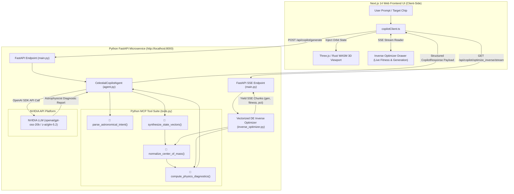
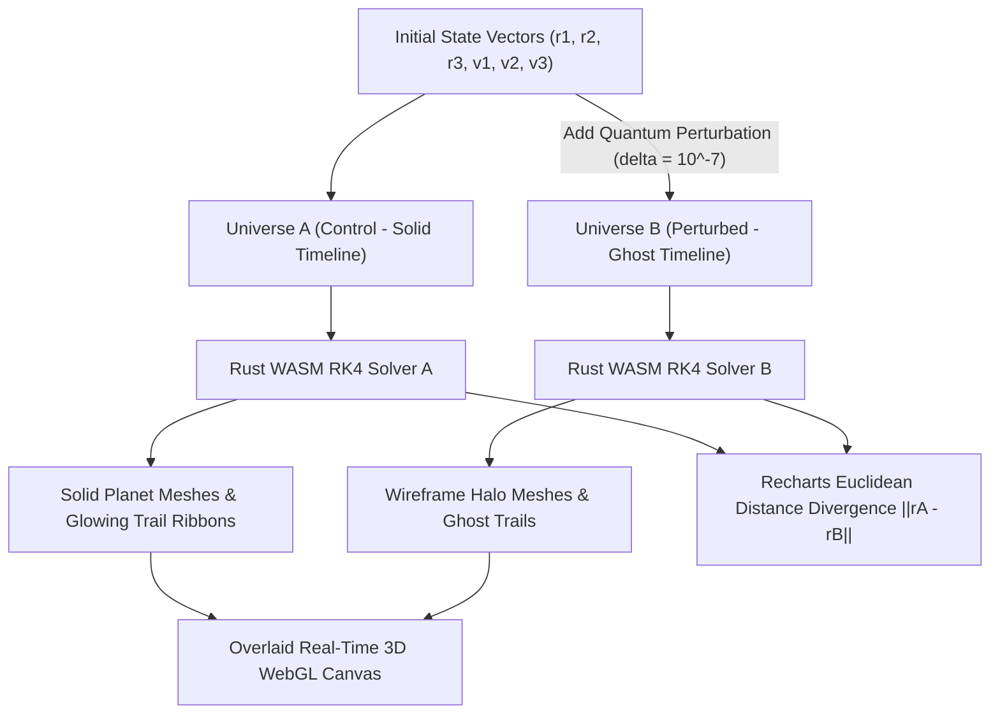
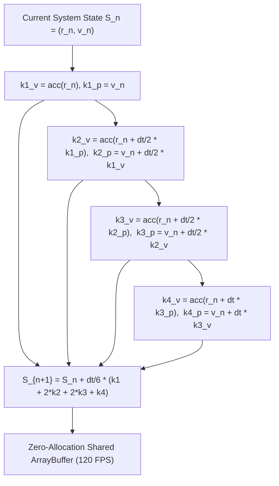

# AstraChaos 3D 🦋🪐
### Agentic Physics Copilot & Generative Inverse Physics Engine for 3D Three-Body Celestial Chaos

[](https://Pranjalya.github.io/AstraChaos-3D)
[](LICENSE)
[](https://fastapi.tiangolo.com/)
[](https://integrate.api.nvidia.com/)
[](https://www.rust-lang.org/)
[](https://nextjs.org/)
[](https://github.com/Pranjalya/AstraChaos-3D/pkgs/container/astrachaos-3d-backend)

**AstraChaos 3D** is an interactive, dark-themed 3D celestial mechanics simulator, **Generative Inverse Physics Engine**, and **Agentic Physics Copilot**. Designed for computational physicists, ML engineers, and space enthusiasts, it physically demonstrates the **Butterfly Effect** (extreme sensitivity to initial conditions) using the non-integrable deterministic chaos of the **Three-Body Problem**.

Architected & Developed by **[Pranjalya Tiwari](https://github.com/Pranjalya)**.

👉 **[Launch Live Interactive Sandbox](https://Pranjalya.github.io/AstraChaos-3D)**

---

## 🔬 Mathematical Foundations & Dynamical System Modeling

The classical Three-Body Problem models the gravitational interaction of three point masses $m_1, m_2, m_3 \in \mathbb{R}^+$ governed by Newton's law of universal gravitation. Because the system possesses 18 degrees of freedom and only 10 classical integrals of motion (Energy, Linear Momentum, Angular Momentum, Center of Mass motion), it is non-integrable in closed analytic form (Poincaré, 1890).

### 1. Equations of Motion with Gravitational Softening
The acceleration $\mathbf{a}_i = \ddot{\mathbf{r}}_i \in \mathbb{R}^3$ of body $i \in \{1, 2, 3\}$ at position $\mathbf{r}_i$ is given by:

$$\mathbf{a}_i = \sum_{\substack{j=1 \\ j \neq i}}^{3} G m_j \frac{\mathbf{r}_j - \mathbf{r}_i}{\left(\|\mathbf{r}_j - \mathbf{r}_i\|^2 + \epsilon^2\right)^{3/2}}$$

where $G$ is the gravitational constant and $\epsilon^2 = 10^{-4} \dots 10^{-3}$ is a **Plummer softening parameter** introduced to eliminate numerical singularities during ultra-close encounters.

### 2. Hamiltonian Energy & Mechanical Invariants
The total Hamiltonian mechanical energy $E_{\text{tot}} = T + V$ is a conserved physical invariant:

$$T = \frac{1}{2} \sum_{i=1}^{3} m_i \|\mathbf{v}_i\|^2, \quad V = -\sum_{1 \le i < j \le 3} \frac{G m_i m_j}{\sqrt{\|\mathbf{r}_j - \mathbf{r}_i\|^2 + \epsilon^2}}$$

Total angular momentum vector $\mathbf{L} \in \mathbb{R}^3$ is similarly conserved:

$$\mathbf{L} = \sum_{i=1}^{3} m_i \left( \mathbf{r}_i \times \mathbf{v}_i \right)$$

### 3. Center of Mass (COM) & Linear Momentum Normalization
To prevent unphysical translational drift in the WebGL coordinate frame, initial conditions undergo rigid translation and Galilean transformation to enforce zero momentum ($\mathbf{P} = \mathbf{0}$) and COM at origin ($\mathbf{r}_{\text{COM}} = \mathbf{0}$):

$$\mathbf{r}_{\text{COM}} = \frac{\sum m_i \mathbf{r}_i}{\sum m_i} = \mathbf{0}, \quad \mathbf{P} = \sum m_i \mathbf{v}_i = \mathbf{0} \implies \mathbf{r}'_i = \mathbf{r}_i - \mathbf{r}_{\text{COM}}, \quad \mathbf{v}'_i = \mathbf{v}_i - \frac{\mathbf{P}}{\sum m_i}$$

### 4. Exponential Lyapunov Divergence & Chaos Horizon
Given two initial state trajectories $S_A(0)$ and $S_B(0) = S_A(0) + \delta \mathbf{r}_0$ perturbed by $\delta \mathbf{r}_0 \sim 10^{-7}$, the spatial divergence $\delta r(t) = \|\mathbf{r}^{(A)}_1(t) - \mathbf{r}^{(B)}_1(t)\|$ exhibits exponential growth characterized by the maximum Lyapunov exponent $\lambda$:

$$\delta r(t) \sim \delta r(0) \, e^{\lambda t}$$

The **Lyapunov Chaos Horizon Time** $t_{\text{chaos}}$ estimates the predictability limit before Universe A and Universe B trajectories completely decorrelate:

$$t_{\text{chaos}} \approx \frac{\ln(1 / \|\delta \mathbf{r}_0\|)}{\lambda}$$

---

## 🎯 Target-Driven Generative Inverse Physics Engine

The **Inverse Trajectory Optimizer** allows engineers to reverse-engineer chaotic initial condition state vectors $\mathbf{x} = [\mathbf{r}_1, \mathbf{r}_2, \mathbf{r}_3, \mathbf{v}_1, \mathbf{v}_2, \mathbf{v}_3]^T \in \mathbb{R}^{18}$ from natural language goal queries (e.g. *"slingshot boost"*, *"eject Body 3"*, *"binary capture"*, *"trojan equilibrium"*).

### Vectorized Differential Evolution (DE) Algorithm
The Python backend (`backend/app/inverse_optimizer.py`) implements a parallelized **Differential Evolution (DE/rand/1/bin)** optimization engine over the 18D parameter space:

```
Algorithm: Vectorized Differential Evolution Trajectory Search
----------------------------------------------------------------
Population Size: N_p = 32 candidates
Max Generations: G_max = 40
Mutation Factor: F = 0.6
Crossover Prob:  CR = 0.7

1. Initialize candidate population X_i ~ Uniform(-2.5, 2.5) for pos, Uniform(-1.2, 1.2) for vel.
2. Normalize each candidate: Shift COM to origin (0,0,0) and set P = 0.
3. For gen = 1 to G_max:
    a. Parallel batch RK4 rollout over rollout horizon T_steps = 400.
    b. Compute fitness score f(X_i) in [0.0, 1.0] using target loss function L_goal.
    c. For each candidate i in N_p:
        - Select 3 distinct random candidates a, b, c != i.
        - Create mutant vector: V_i = X_a + F * (X_b - X_c)
        - Perform binomial crossover with probability CR to generate trial candidate U_i.
        - Normalize U_i (COM = 0, P = 0).
    d. Roll out trial population U_i and evaluate fitness f(U_i).
    e. Selection: If f(U_i) >= f(X_i), replace X_i with U_i.
    f. Yield SSE event chunk with progress_pct, generation, and best_fitness.
    g. Early stop if best_fitness >= 0.96.
4. Format optimal initial state vectors, run diagnostics, and stream payload to client.
```

### Signature Non-Convex Fitness Loss Formulations

| Target Goal | Mathematical Objective / Fitness Formulation $f(\mathbf{x})$ | Key Physical Behavior |
| :--- | :--- | :--- |
| **🚀 Slingshot Boost** | $f = 0.5 \min\left(\frac{v_{3,\max}}{3 v_{3,0}}, 1\right) + 0.5 \exp\left(-\frac{(d_{\min} - 0.25)^2}{0.1}\right)$ | Maximizes peak kinetic energy ratio of Body 3 after a close encounter with Body 1/2. |
| **☄️ Chaotic Ejection** | $f = 0.3 \text{bound}(r_{3,0}) + 0.4 \min\left(\frac{r_{3,T}}{10}, 1\right) + 0.3 \text{escape\_speed}$ | Body 3 transitions from bound initial orbit ($r_3 < 3.0$) to asymptotic escape ($r_3 > 8.0$). |
| **🌌 Resonant Binary Capture** | $f = 0.5 \min\left(\frac{1.5}{\bar{d}_{31} + 0.1}, 1\right) + 0.5 \min\left(\frac{1.5}{\bar{d}_{23} + 0.1}, 1\right)$ | Body 3 shifts orbital binding from Body 1 during $T_1$ to Body 2 during $T_2$. |
| **🛡️ Trojan Equilibrium** | $f = 0.6 \exp\left(-\frac{\bar{\Delta}_{\text{tri}}}{0.8}\right) + 0.4 \exp\left(-\frac{\text{Var}(d_{12}) + \text{Var}(d_{23}) + \text{Var}(d_{31})}{0.5}\right)$ | Enforces Lagrangian equilateral triangle libration ($d_{12} \approx d_{23} \approx d_{31}$). |
| **💥 Triple Close Encounter** | $f = \exp\left(-\frac{(d_{\min} - 0.18)^2}{0.02}\right) \quad \text{subject to } d_{\min} \ge 0.08$ | Ultra-close non-collisional flyby of all 3 bodies within tight spatial radius. |

---

## 🤖 Agentic AI Orchestration & MCP Microservice Architecture

AstraChaos 3D incorporates an **Agentic Physics Copilot** designed around Model Context Protocol (MCP) microservice patterns.

### System Architecture & Dataflow



### Python MCP Tool Suite (`backend/app/tools.py`)

1. **`parse_astronomical_intent(prompt: str)`**: Parses astronomical terminology (*"figure-eight"*, *"pythagorean"*, *"slingshot"*, *"trojan"*, *"collinear"*) and matches optimal orbital topology.
2. **`synthesize_state_vectors(topology, perturbation)`**: Generates 3D position matrices $\mathbf{P} \in \mathbb{R}^{3 \times 3}$, velocity matrices $\mathbf{V} \in \mathbb{R}^{3 \times 3}$, and body color hex values.
3. **`normalize_center_of_mass(masses, pos, vel)`**: Performs Galilean COM shift to origin $(0,0,0)$ and cancels total linear momentum ($\mathbf{P} = \mathbf{0}$).
4. **`compute_physics_diagnostics(masses, pos, vel, perturbation)`**: Calculates kinetic energy $T$, potential energy $V$, total mechanical energy $E$, total angular momentum $\|\mathbf{L}\|$, Lyapunov exponent $\lambda$, and chaos horizon $t_{\text{chaos}}$.
5. **`astrophysics_llm_reasoning(prompt, system_type, mass_ratio)`**: Queries NVIDIA LLM platform for domain-specific astrophysics reasoning on resonance boundaries and potential wells.

### Resilient Dual-Engine Strategy
To guarantee **100% operational availability**:
* **Online Mode:** Connects to Python microservice at `http://localhost:8000` for LLM parameter extraction, server-side tool execution, and SSE inverse optimization.
* **Offline Client Fallback:** If the backend microservice is offline or deployed as a static site on GitHub Pages, `copilotClient.ts` seamlessly activates an in-browser deterministic tool suite, ensuring zero UI crashes or broken interactions.

---

## 🦋 Dual-Universe Butterfly Effect & Quantum Perturbation Engine

To visually prove deterministic chaos, AstraChaos 3D renders **two parallel gravitational universes** simultaneously in the WebGL scene:



* **Universe A (Control):** Follows exact initial conditions with solid textured celestial bodies and glowing orbit trails.
* **Universe B (Perturbed):** Displaces Body 1's position by a microscopic perturbation $\delta \in [10^{-3}, 10^{-9}]$ (default $\delta = 10^{-7}$). Rendered with wireframe ghost halos and translucent trails.
* **Perturbation Scale Slider:** Dynamically tune $\delta$ down to Planck-scale perturbations ($10^{-9}$) to observe the shift in chaos horizon time $t_{\text{chaos}}$.

---

## ⚡ High-Performance Rust / WebAssembly Physics Engine

The numerical integration engine is compiled from **Rust to WebAssembly (WASM)** (`wasm-physics/src/lib.rs`) using `wasm-pack`.

### Numerical Integration Pipeline



### WASM Features & Performance
* **4th-Order Runge-Kutta Integrator:** Fourth-order accuracy $O(\Delta t^4)$ per sub-step.
* **Zero-Allocation Shared Memory:** Pointers to contiguous F32 position arrays (`get_positions_a()`, `get_positions_b()`) passed directly into Three.js instanced mesh buffers without garbage collection pauses.
* **120 FPS Throughput:** Sub-millisecond execution times for dual-universe updates with up to 100 sub-steps per frame.

---

## 🚀 Key Features & Telemetry Workbench

| Feature Component | Technology | Description |
| :--- | :--- | :--- |
| **Generative Inverse Optimizer** | NumPy, Differential Evolution, SSE | Reverse-engineers 18D state vectors from natural language goals with real-time SSE progress drawer. |
| **Agentic Physics Copilot** | Python FastAPI, NVIDIA Nemotron, OpenAI SDK | Synthesizes custom celestial orbits from prompt text using LLMs and structured physics tool calls. |
| **Dual-Universe Viewport** | Three.js, React Three Fiber, WebAssembly | Overlays solid control universe against wireframe perturbed universe to demonstrate the Butterfly Effect. |
| **Real-Time Divergence Analytics** | Recharts, TypeScript | Live plots tracking spatial divergence $\|\mathbf{r}_A - \mathbf{r}_B\|$ on linear and $\log_{10}$ logarithmic axes. |
| **Physics Diagnostics Scorecard** | Python / TS Physics Modules | Calculates Hamiltonian energy conservation ($\Delta E / E_0$), angular momentum vector, and chaos horizon time. |
| **Orbital Presets Vault** | Classical Celestial Mechanics | Pre-configured orbits: Chenciner Figure-Eight, Pythagorean 3-Body (Burrau), Lagrange Horseshoe, Chaotic Hyper-Collision, Euler Collinear. |
| **Interactive Controls** | Tailwind CSS, Lucide Icons | Body mass sliders, color pickers, time-step scaling ($\Delta t$), camera target locks (Body 1, 2, 3, or COM). |

---

## 🐳 Docker Container & GitHub Container Registry (GHCR)

The Python FastAPI backend microservice is fully containerized and published to **GitHub Container Registry (GHCR)** via automated CI/CD workflows (`.github/workflows/docker-ghcr.yml`).

### Pull & Run Container from GHCR

```bash
# 1. Pull published container image from GHCR
docker pull ghcr.io/pranjalya/astrachaos-3d-backend:latest

# 2. Run container on port 8000 with NVIDIA API key
docker run -d \
  -p 8000:8000 \
  -e NVIDIA_API_KEY="your_nvidia_api_key_here" \
  --name astrachaos-backend \
  ghcr.io/pranjalya/astrachaos-3d-backend:latest
```

### Local Docker Build & Test

```bash
# Build local container image
cd backend
docker build -t astrachaos-3d-backend .

# Run local container
docker run -p 8000:8000 -e NVIDIA_API_KEY="your_nvidia_api_key_here" astrachaos-3d-backend
```

---

## 📡 API Endpoints Reference

| Endpoint | Method | Payload / Query | Description |
| :--- | :--- | :--- | :--- |
| `/api/health` | `GET` | None | Returns backend status, service health, and NVIDIA LLM connectivity status. |
| `/api/copilot/generate` | `POST` | `CopilotRequest` JSON | Synthesizes orbital state vectors and astrophysics reasoning report from user prompt. |
| `/api/copilot/optimize_inverse/stream` | `GET` | `goal_type`, `custom_prompt`, `max_generations` | Streams real-time SSE progress events for 18D state vector trajectory optimization. |
| `/api/copilot/diagnostics` | `POST` | Positions, Velocities, Masses | Calculates energy breakdown, angular momentum vector, and Lyapunov chaos horizon metrics. |

---

## ⚙️ Local Development & Installation

### Prerequisites
* **Node.js**: v18.0+
* **Rust & Cargo**: Latest stable toolchain
* **wasm-pack**: `cargo install wasm-pack`
* **Python**: 3.10+ (for backend microservice)

### Setup Instructions

```bash
# 1. Clone Repository
git clone https://github.com/Pranjalya/AstraChaos-3D.git
cd AstraChaos-3D

# 2. Compile WASM Physics Core
cd wasm-physics
wasm-pack build --target web --out-dir ../public/wasm
cd ..

# 3. Install Frontend Dependencies
npm install

# 4. (Optional) Setup Python Backend Microservice
cd backend
python -m venv venv
source venv/bin/venv/activate  # On Windows: venv\Scripts\activate
pip install -r requirements.txt
cp .env.example .env          # Add your NVIDIA_API_KEY if desired
cd ..

# 5. Launch Development Environment
# Start Frontend (http://localhost:3000)
npm run dev

# Start Backend (http://localhost:8000)
cd backend && uvicorn app.main:app --reload --port 8000
```

---

## 📂 Repository Layout

```
AstraChaos-3D/
├── .github/
│   └── workflows/
│       ├── deploy.yml            # CI/CD: Static GitHub Pages deployment
│       └── docker-ghcr.yml       # CI/CD: Docker build & GHCR publish workflow
├── backend/                      # Agentic AI & Optimization Backend (Python FastAPI)
│   ├── app/
│   │   ├── agent.py              # CelestialCopilotAgent & LLM reasoning parser
│   │   ├── inverse_optimizer.py  # Vectorized DE trajectory optimizer & SSE generator
│   │   ├── main.py               # FastAPI gateway & CORS configuration
│   │   ├── schemas.py            # Pydantic data contract schemas
│   │   └── tools.py              # Python MCP tool suite (COM norm, diagnostics)
│   ├── tests/                    # Pytest backend test suite
│   │   ├── test_api.py
│   │   ├── test_inverse_optimizer.py
│   │   └── test_physics_tools.py
│   ├── Dockerfile                # Multi-stage Docker container build
│   └── requirements.txt
├── public/
│   └── wasm/                     # Compiled WebAssembly physics bundle
├── src/                          # Next.js 14 Frontend Application (TypeScript)
│   ├── app/
│   │   ├── page.tsx              # Main interactive 3D application layout
│   │   └── globals.css
│   ├── components/
│   │   ├── canvas/               # Three.js / R3F Canvas components
│   │   │   ├── Bodies.tsx        # Render solid & ghost planet meshes
│   │   │   ├── CameraController.tsx # OrbitControls & target-lock tracking
│   │   │   ├── SimulationCanvas.tsx # Main WebGL R3F canvas wrapper
│   │   │   └── Trails.tsx        # Trailing particle ribbon buffers
│   │   └── ui/                   # Glassmorphic UI overlays
│   │       ├── AnalyticsDrawer.tsx  # Recharts divergence plot drawer
│   │       ├── ControlPanel.tsx     # Comprehensive simulation parameter panel
│   │       ├── CopilotDrawer.tsx    # Natural language AI copilot drawer
│   │       ├── Header.tsx           # App header with live metrics & preset menu
│   │       └── InverseOptimizerDrawer.tsx # Live SSE optimization progress drawer
│   ├── types/
│   │   └── physics.ts            # TypeScript physical interfaces & presets
│   └── utils/
│       ├── copilotClient.ts      # Dual-engine API client & deterministic fallback
│       ├── presets.ts            # Orbital presets vault configuration
│       └── wasmBridge.ts         # WASM physics engine lifecycle wrapper
└── wasm-physics/                 # High-Performance Physics Core (Rust)
    ├── Cargo.toml
    └── src/
        └── lib.rs                # 4th-Order Runge-Kutta solver in Rust
```

---

## 📚 Academic Citations & References

If you use **AstraChaos 3D** for academic research, computational physics education, or visual demonstrations, please cite the foundational literature:

### Foundational Publications

1. **Poincaré, H. (1890).** *Sur le problème des trois corps et les équations de la dynamique.* Acta Mathematica, 13(1), 1–270. [DOI: 10.1007/BF02392506](https://doi.org/10.1007/BF02392506)
2. **Lorenz, E. N. (1963).** *Deterministic Nonperiodic Flow.* Journal of the Atmospheric Sciences, 20(2), 130–141. [DOI: 10.1175/1520-0469(1963)020<0130:DNF>2.0.CO;2](https://doi.org/10.1175/1520-0469(1963)020%3C0130:DNF%3E2.0.CO;2)
3. **Chenciner, A., & Montgomery, R. (2000).** *A remarkable periodic solution of the three-body problem in the case of equal masses.* Annals of Mathematics, 152(3), 881–901. [DOI: 10.2307/2661357](https://doi.org/10.2307/2661357)
4. **Szebehely, V., & Peters, C. F. (1967).** *Complete Solution of the Pythagorean Problem of Three Bodies.* Astronomical Journal, 72, 876–883. [DOI: 10.1086/110355](https://doi.org/10.1086/110355)

### BibTeX Entry

```bibtex
@article{poincare1890probleme,
  author    = {Poincar{\'e}, Henri},
  title     = {Sur le probl{\`e}me des trois corps et les {\'e}quations de la dynamique},
  journal   = {Acta Mathematica},
  volume    = {13},
  number    = {1},
  pages     = {1--270},
  year      = {1890},
  publisher = {Springer}
}

@article{lorenz1963deterministic,
  author    = {Lorenz, Edward N.},
  title     = {Deterministic Nonperiodic Flow},
  journal   = {Journal of the Atmospheric Sciences},
  volume    = {20},
  number    = {2},
  pages     = {130--141},
  year      = {1963}
}

@article{chenciner2000remarkable,
  author    = {Chenciner, Alain and Montgomery, Richard},
  title     = {A remarkable periodic solution of the three-body problem in the case of equal masses},
  journal   = {Annals of Mathematics},
  volume    = {152},
  number    = {3},
  pages     = {881--901},
  year      = {2000}
}

@misc{tiwari2026astrachaos,
  author    = {Tiwari, Pranjalya},
  title     = {AstraChaos 3D: High-Performance Interactive 3D Three-Body Problem \& Butterfly Effect Sandbox},
  year      = {2026},
  publisher = {GitHub},
  journal   = {GitHub Repository},
  howpublished = {\url{https://github.com/Pranjalya/AstraChaos-3D}}
}
```

---

## 👤 Author & License

* **Author:** [Pranjalya Tiwari](https://github.com/Pranjalya)
* **Repository:** [https://github.com/Pranjalya/AstraChaos-3D](https://github.com/Pranjalya/AstraChaos-3D)
* **Live Sandbox:** [https://Pranjalya.github.io/AstraChaos-3D](https://Pranjalya.github.io/AstraChaos-3D)
* **License:** [MIT License](LICENSE)